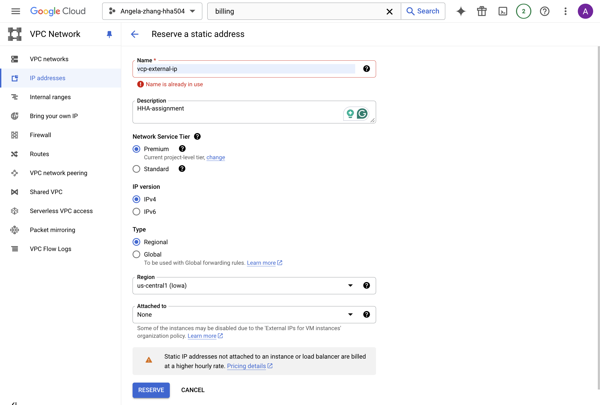

# Objective
The objective of this assignment is to explore the networking features in Azure and Google Cloud Platform (GCP), focusing on Virtual Private Cloud (VPC), Virtual Private Network (VPN), IP addresses, and domain management. You will gain practical experience in assigning dedicated IPs and mapping them to domains.

## 1. Create a Virtual Private Cloud (VPC)
- **Azure:**
  - Navigate to the Azure portal and create a new Virtual Network (VNet).
  - Choose a simple IP address range and subnet configuration.

- **GCP:**
  - Access the Google Cloud Console and create a new VPC network.
  - Configure the IP address range and subnets similarly to your Azure setup.

## 2. Assign a Dedicated IP
- **Azure:**
  - Reserve a static public IP address for a resource (e.g., a virtual machine) within your VNet.

- **GCP:**
  - Reserve a static external IP address for a Compute Engine instance within your VPC.

## 3. Map IP to a Domain
Steps I took to map the IP address to a domain in both platforms: 
 **Azure:**
  - Use Azure DNS or an external domain registrar to map the reserved IP address to a domain name.
- **GCP:**
  - Use Google Cloud DNS or an external domain registrar to map the reserved IP address to a domain name.

## 4. Explore VPN and Tunnels (Optional)
Notes on VPN setup in Azure and GCP:
- **Azure:**
  - Explore the VPN Gateway service and document the steps you would take to set up a site-to-site VPN.
- **GCP:**
  - Explore the Cloud VPN service and outline the process to create a tunnel between two VPCs.
