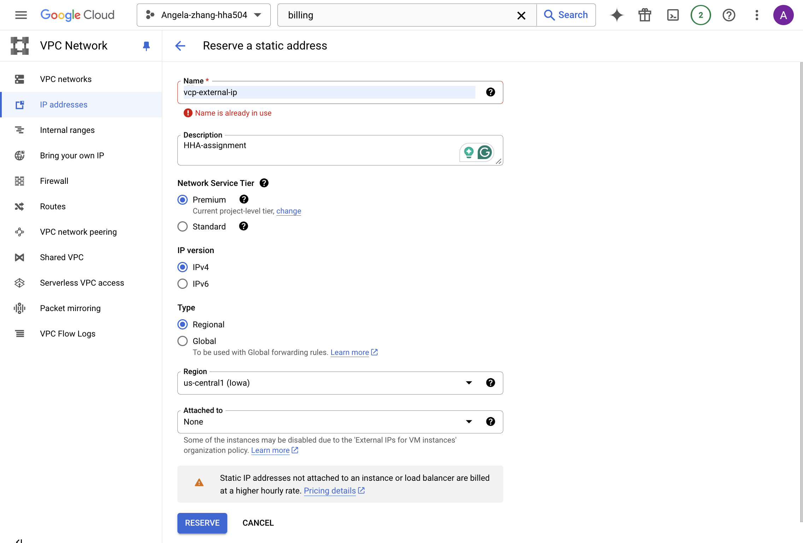

# Objective
The objective of this assignment is to explore the networking features in Azure and Google Cloud Platform (GCP), focusing on Virtual Private Cloud (VPC), Virtual Private Network (VPN), IP addresses, and domain management. You will gain practical experience in assigning dedicated IPs and mapping them to domains.

## 1. Create a Virtual Private Cloud (VPC)
**Azure:**
  - Navigate to the Azure portal and create a new Virtual Network (VNet).

Choose a simple IP address range and subnet configuration.

**GCP:**
  - Access the Google Cloud Console and create a new VPC network.

Configure the IP address range and subnets similarly to your Azure setup.

## 2. Assign a Dedicated IP
**Azure:**
  - Reserve a static public IP address for a resource (e.g., a virtual machine) within your VNet.

**GCP:**
  - Reserve a static external IP address for a Compute Engine instance within your VPC.

Go to **VPC Network > External IP addresses**  
Click **Reserve static address** 

Next, we will assign the static IP to a VM instance  
Go to **VM instances**

## 3. Map IP to a Domain Acquired via GitHub Student Pack
- Use your GitHub Student Developer Pack to acquire a domain through Namecheap (or another supported registrar).
- Set up an **A record** for your main domain (e.g., `yourdomain.com`) and a **subdomain** (e.g., `app.yourdomain.com`).

## 4. Deploy Flask Application
- Deploy the provided Flask application located at [HHA 504 Flask Networking](https://github.com/hantswilliams/hha-504-flask-networking) to your virtual machine on Azure or GCP.
- Ensure that the Flask application is running on a specific port (e.g., port 5007).

## 5. Configure Firewall Settings
- Make sure that the port on which your Flask application is running is accessible to the general public.
  - **Azure:** Configure Network Security Group (NSG) rules to allow inbound traffic on the specified port.
  - **GCP:** Configure Firewall rules to allow traffic on the specified port.

## 6. Access Your Application via Domain
- Visit your deployed Flask application using the custom domain or subdomain you mapped, including the port number in the URL (e.g., `http://app.yourdomain.com:5000`).